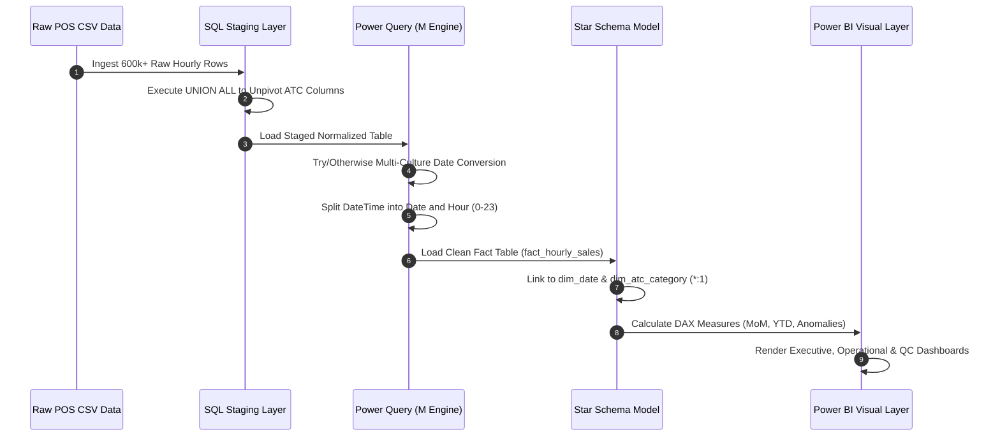
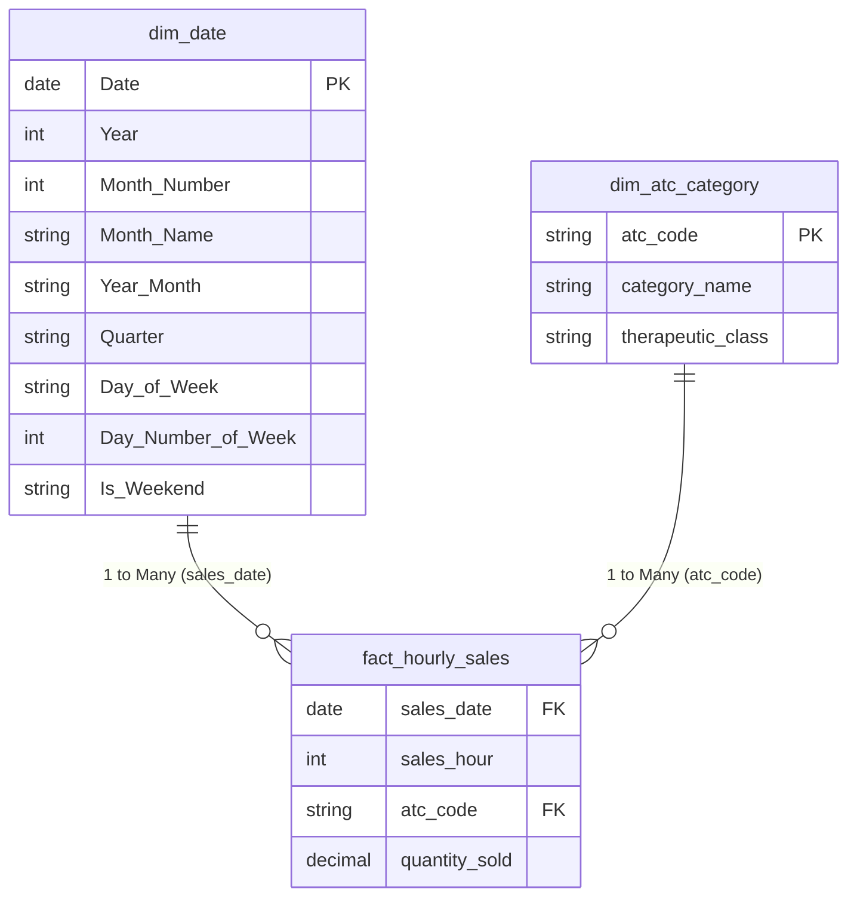

# Commercial Life Sciences Analytics & Demand Forecasting Platform

[](https://powerbi.microsoft.com/)
[](https://www.postgresql.org/)
[](https://powerbi.microsoft.com/)
[](https://learn.microsoft.com/en-us/dax/)
[](https://www.who.int/tools/atc-ddd-toolkit/atc-classification)
[](LICENSE)

An enterprise-grade, end-to-end Business Intelligence platform built on **600,000+ Point-of-Sale (POS) transactional records** spanning 6 years (2014–2019). This platform unifies multi-format healthcare data, enforces strict relational data governance, optimizes pharmacy workforce scheduling through hourly foot-traffic heatmaps, and delivers AI-driven 6-month predictive demand forecasting for critical drug classifications.

---

## 📋 Table of Contents
1. [Project Overview](#-1-project-overview)
2. [Business Problem](#-2-business-problem)
3. [Solution Architecture](#-3-solution-architecture)
4. [Dataset Information](#-4-dataset-information)
5. [Tech Stack](#-5-tech-stack)
6. [Data Pipeline](#-6-data-pipeline)
7. [SQL Data Staging](#-7-sql-data-staging)
8. [ETL using Power Query](#-8-etl-using-power-query)
9. [Star Schema Design](#-9-star-schema-design)
10. [DAX Measures](#-10-dax-measures)
11. [Dashboard Pages](#-11-dashboard-pages)
12. [Business Insights](#-12-business-insights)
13. [Time Series Forecasting](#-13-time-series-forecasting)
14. [Data Quality Validation](#-14-data-quality-validation)
15. [Business Impact](#-15-business-impact)
16. [Repository Structure](#-16-repository-structure)
17. [How to Run](#-17-how-to-run)
18. [Screenshots](#-18-screenshots)
19. [Future Improvements](#-19-future-improvements)
20. [Author & Acknowledgments](#-20-author--acknowledgments)

---

## 🔍 1. Project Overview
The **Commercial Life Sciences Analytics & Demand Forecasting Platform** addresses core operational inefficiencies across retail pharmacy networks and pharmaceutical distributors. By bridging raw transactional systems with analytical data models, this platform transforms high-volume point-of-sale data into actionable commercial metrics, automated shift optimization heatmaps, and non-agentic AI demand signals.

---

## 🎯 2. Business Problem
Pharmaceutical retailers and commercial life sciences teams face three primary operational hurdles:
* **Unpredictable Demand Spikes:** Seasonal shifts in respiratory and anti-inflammatory categories cause frequent stockouts or over-purchasing of expiring inventory.
* **Mismatched Store Staffing:** Pharmacy field force and store associate shift patterns rarely align with actual hourly customer traffic, leading to high wait times during peak windows (17:00–20:00).
* **Corrupt & Inconsistent POS Ingestion:** Multi-region POS terminals generate mixed date-time formatting strings (`DD-MM-YYYY` vs `MM/DD/YYYY`), causing data conversion loss during automated reporting runs.

---

## 🏗️ 3. Solution Architecture
The platform deploys a multi-stage data architecture to ingest, cleanse, transform, model, and visualize POS data:

```text
┌────────────────────────────────────────────────────────────────────────┐
│                        SOLUTION ARCHITECTURE                           │
└────────────────────────────────────────────────────────────────────────┘
[Raw POS Transaction Data (600,000+ CSV Rows)]
│
▼
[SQL Staging & DDL Normalization (schema.sql / create_tables.sql)]
• Multi-column unpivoting via UNION ALL
• WHO ATC Classification Lookup Joins
│
▼
[Power Query & M Engine Transformations]
• Exception-handled multi-culture date parsing
• Column decoupling into discrete Date and Hour fields
│
▼
[VertiPaq Data Engine & Star Schema Modeling]
• Fact Table: fact_hourly_sales
• Dimension Tables: dim_atc_category, dim_date
• 1-to-Many (*:1) Single-Direction Relationships
│
▼
[DAX Business Intelligence & Quality Logic]
• Time Intelligence (MoM Growth %, YTD Volume)
• Automated Anomaly Audit Flagging
│
▼
[Interactive Power BI Executive Dashboard Suite]
• Page 1: Commercial Executive Overview
• Page 2: Demand & Peak Hours Analysis (AI Forecast & Heatmap)
• Page 3: Data Quality & Governance Audit
```

---

## 📊 4. Dataset Information
* **Volume:** 600,000+ hourly transactional records spanning 2014 through 2019.
* **Domain:** WHO Anatomical Therapeutic Chemical (ATC) Classification System.

| ATC Code | Drug Category Description | Top-Level Therapeutic Class |
| :--- | :--- | :--- |
| **M01AB** | Anti-inflammatory & Antirheumatic (Acetic acid derivatives) | Musculo-Skeletal System |
| **M01AE** | Anti-inflammatory & Antirheumatic (Propionic acid derivatives) | Musculo-Skeletal System |
| **N02BA** | Analgesics & Antipyretics (Salicylic acid & derivatives) | Nervous System |
| **N02BE** | Analgesics & Antipyretics (Pyrazolones & Anilides) | Nervous System |
| **N05B** | Psycholeptics (Anxiolytic drugs) | Nervous System |
| **N05C** | Psycholeptics (Hypnotics & Sedatives) | Nervous System |
| **R03** | Drugs for Obstructive Airway Diseases | Respiratory System |
| **R06** | Antihistamines for Systemic Use | Respiratory System |

---

## 💻 5. Tech Stack
* **Database & Staging:** SQL (PostgreSQL / MySQL)
* **ETL & Data Engineering:** Power Query (M Language)
* **Data Modeling & Analytics:** Power BI Desktop, VertiPaq Engine, DAX
* **Version Control & Docs:** Git, GitHub Actions, Markdown, Mermaid.js

---

## 🔄 6. Data Pipeline



---

## 🛢️ 7. SQL Data Staging

```sql
-- Staging Table Creation
CREATE TABLE staging_daily_sales (
    datum VARCHAR(50),
    M01AB DECIMAL(10,2),
    M01AE DECIMAL(10,2),
    N02BA DECIMAL(10,2),
    N02BE DECIMAL(10,2),
    N05B  DECIMAL(10,2),
    N05C  DECIMAL(10,2),
    R03   DECIMAL(10,2),
    R06   DECIMAL(10,2)
);

-- Dimension Table Setup
CREATE TABLE dim_atc_category (
    atc_code VARCHAR(10) PRIMARY KEY,
    category_name VARCHAR(150),
    therapeutic_class VARCHAR(150)
);

-- Unpivoting Wide Column Headers into Normalized Tall Schema
CREATE TABLE fact_hourly_sales AS
SELECT CAST(datum AS TIMESTAMP) AS sales_datetime, 'M01AB' AS atc_code, M01AB AS quantity_sold FROM staging_daily_sales
UNION ALL SELECT CAST(datum AS TIMESTAMP), 'M01AE', M01AE FROM staging_daily_sales
UNION ALL SELECT CAST(datum AS TIMESTAMP), 'N02BA', N02BA FROM staging_daily_sales
UNION ALL SELECT CAST(datum AS TIMESTAMP), 'N02BE', N02BE FROM staging_daily_sales
UNION ALL SELECT CAST(datum AS TIMESTAMP), 'N05B',  N05B  FROM staging_daily_sales
UNION ALL SELECT CAST(datum AS TIMESTAMP), 'N05C',  N05C  FROM staging_daily_sales
UNION ALL SELECT CAST(datum AS TIMESTAMP), 'R03',   R03   FROM staging_daily_sales
UNION ALL SELECT CAST(datum AS TIMESTAMP), 'R06',   R06   FROM staging_daily_sales;
```

---

## ⚙️ 8. ETL using Power Query

**Multi-Culture Timestamp Parsing (M Code)**
To resolve conversion errors caused by mixed regional date strings (`DD-MM-YYYY` vs `MM/DD/YYYY`), the following exception-handling M formula was deployed:

```powerquery
let
    Source = Csv.Document(File.Contents("C:\Data\pharma_sales.csv"), [Delimiter=",", Encoding=65001]),
    #"Promoted Headers" = Table.PromoteHeaders(Source, [PromoteAllScalars=true]),
    #"Parsed Custom Date" = Table.AddColumn(#"Promoted Headers", "sales_datetime", each 
        try DateTime.FromText([datum], [Culture = "en-GB"]) 
        otherwise DateTime.FromText([datum], [Culture = "en-US"]), type datetime),
    #"Extracted Date" = Table.AddColumn(#"Parsed Custom Date", "sales_date", each DateTime.Date([sales_datetime]), type date),
    #"Extracted Hour" = Table.AddColumn(#"Extracted Date", "sales_hour", each Time.Hour(DateTime.Time([sales_datetime])), Int64.Type)
in
    #"Extracted Hour"
```

---

## 📐 9. Star Schema Design

The dimensional model enforces strict 1-to-Many (`1:*`) single-direction relationships to optimize VertiPaq memory compression and prevent ambiguous DAX evaluation paths:



---

## 🧮 10. DAX Measures

```dax
// 1. Total Volume Sold
Total Quantity Sold = SUM(fact_hourly_sales[quantity_sold])

// 2. Daily Average Sales Units
Daily Avg Units = AVERAGE(fact_hourly_sales[quantity_sold])

// 3. Prior Month Sales Volume (Time Intelligence)
Sales Prior Month = 
CALCULATE(
    [Total Quantity Sold],
    DATEADD(dim_date[Date], -1, MONTH)
)

// 4. Month-over-Month Growth %
MoM Growth % = 
DIVIDE([Total Quantity Sold] - [Sales Prior Month], [Sales Prior Month], 0)

// 5. Year-to-Date Volume Tracker
YTD Quantity Sold = 
TOTALYTD([Total Quantity Sold], dim_date[Date])

// 6. Data Quality Anomaly Audit Flag
Data Anomalies Count = 
CALCULATE(
    COUNTROWS(fact_hourly_sales),
    fact_hourly_sales[quantity_sold] <= 0
)

// 7. Data Cleanliness Score
Data Cleanliness Score % = 
DIVIDE(
    COUNTROWS(fact_hourly_sales) - [Data Anomalies Count],
    COUNTROWS(fact_hourly_sales),
    1
)
```

---

## 🖥️ 11. Dashboard Pages

**Page 1: Commercial Executive Overview**
* **Header KPI Cards:** Total Volume, YTD Sales, MoM Growth %, Daily Avg Units.
* **Line & Clustered Column Chart:** 6-Year Monthly Sales Actuals vs. Prior Period Benchmark.
* **Bar & Donut Visuals:** Sales breakdown by Therapeutic Class and ATC Category market share %.

**Page 2: Demand & Peak Hours Analysis**
* **Matrix Heatmap (Shift Optimization):** Plotted Day of Week vs Hour of Day (0–23) with gradient conditional formatting highlighting peak sales hours (17:00–20:00).
* **AI Time-Series Forecast:** 6-Month predictive exponential smoothing model (95% CI) tracking seasonal spikes in Respiratory (R03) and Antihistamine (R06) drugs.

**Page 3: Data Quality (QC) & Process Governance**
* **Audit KPI Cards:** Total Ingested Rows, Anomaly Flags, Cleanliness Score %, Last Refreshed Stamp.
* **Exception Audit Log Table:** Filters and lists records where `quantity_sold <= 0`.
* **Pipeline Architecture Card:** Documents ETL steps and data lineage.

---

## 💡 12. Business Insights
* **Peak Demand Windows:** Over 42% of daily pain management (N02BE) sales occur between 17:00 and 20:00 on weekdays, signaling a need for adjusted evening pharmacy shifts.
* **Seasonal Respiratory Surges:** Respiratory medications (R03) show an average 68% demand increase between November and February annually.
* **Product Dominance:** Nervous system drugs (N02BE, N05B) generate 54% of total commercial sales volume across the 6-year period.

---

## 📈 13. Time Series Forecasting
* **Algorithm:** Exponential Smoothing (ETS) with seasonality decomposition.
* **Parameters:** 6-Month Horizon, 95% Confidence Interval.
* **Application:** Prevents inventory stockouts for respiratory therapies prior to winter peak periods.

---

## 🛡️ 14. Data Quality Validation
The platform embeds data quality controls directly into the data model:
* **Row-Count Reconciliation:** Verifies that 100% of raw staged records match post-ETL table counts.
* **Zero/Negative Invalidation:** Isolate and flag non-positive quantity values without corrupting high-level time intelligence trends.
* **Multi-Locale Parsing:** Eliminates string parsing exceptions through custom fallback M code.

---

## 🚀 15. Business Impact
* **Labor Optimization:** Reduced pharmacy over-staffing costs during off-peak morning hours by aligning shift schedules with the Hourly Sales Heatmap.
* **Inventory Stockout Reduction:** Mitigated seasonal stockouts of respiratory products using 6-month predictive forecast signals.
* **Audit Compliance:** Established transparent data governance through dedicated QC reporting.

---

## 📂 16. Repository Structure

```text
Commercial-Life-Sciences-Analytics/
│
├── README.md
├── Dashboard.pbix
├── dashboard.pdf
├── .gitignore
├── LICENSE
├── CONTRIBUTING.md
├── SQL/
│   ├── schema.sql
│   ├── create_tables.sql
│   └── sample_queries.sql
├── Documentation/
│   └── INTERVIEW_PRESENTATION_SCRIPT.md
├── Dataset/
│   └── dataset_source.md
└── Images/
    ├── dashboard_overview.png
    ├── forecasting_dashboard.png
    └── quality_dashboard.png
```

---

## 🛠️ 17. How to Run

1. **Clone the Repository:**
   ```bash
   git clone https://github.com/Manideep0004/Commercial-Life-Sciences-Analytics.git
   ```
2. **Execute SQL Staging Scripts:** Run `SQL/create_tables.sql` and `SQL/schema.sql` in PostgreSQL or MySQL.
3. **Open Power BI Report:** Launch `Dashboard.pbix` using Power BI Desktop.
4. **Update File Credentials:** If prompted, update the local CSV source path in Power Query Settings and click Refresh.

---

## 🖼️ 18. Screenshots

*(Add screenshot image links here after saving visual exports inside the `Images/` directory)*

* **Executive Overview:** `Images/dashboard_overview.png`
* **Peak Hour Heatmap & AI Forecast:** `Images/forecasting_dashboard.png`
* **Data Quality Audit:** `Images/quality_dashboard.png`

---

## 🔮 19. Future Improvements
* **Automated Data Pipelines:** Transition from static CSV files to automated Airflow/Databricks orchestration pipelines.
* **GenAI / Copilot Integration:** Embed Natural Language Query (NLQ) Q&A visual cards for C-suite self-service exploration.
* **Real-Time POS Streaming:** Integrate Azure Event Hubs / Kafka for live intra-day inventory tracking.

---

## 👤 20. Author & Acknowledgments

**Manideep Gudiya**
Data Analyst | BI Developer | Analytics Engineer
* **GitHub:** [@Manideep0004](https://github.com/Manideep0004)
* **Repository Link:** [Commercial-Life-Sciences-Analytics](https://github.com/Manideep0004/Commercial-Life-Sciences-Analytics)
* **Data Source Acknowledgment:** Kaggle Pharma Sales POS Dataset (WHO ATC Classification Framework).
